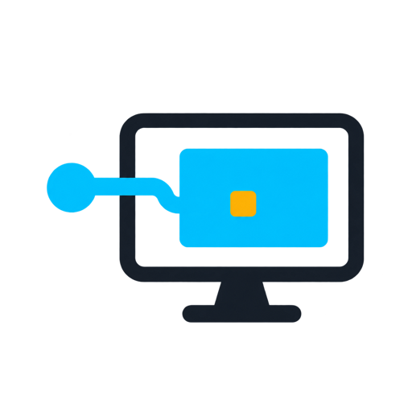
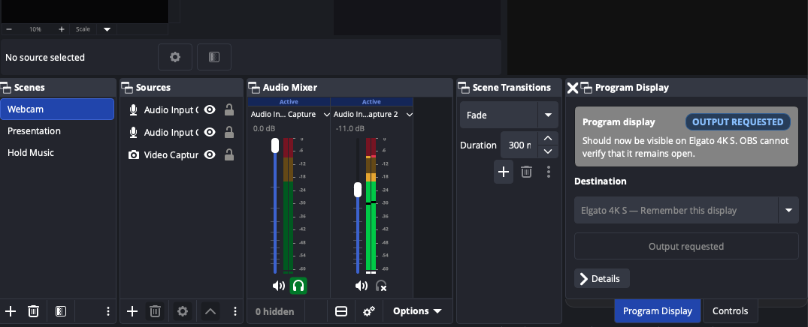

<p align="center">
  
</p>

# Program Display

[](https://github.com/jonathanrelf/program-display/actions/workflows/ci.yaml)
[](https://github.com/jonathanrelf/program-display/releases)
[](LICENSE)

Program Display is an independent, open-source plugin that remembers which
physical macOS display should show the OBS Studio Program feed. When OBS starts,
or when that display is reconnected, the plugin resolves the saved display
identity against the displays that are connected now and asks OBS to open its
fullscreen Program projector there.

The plugin exists to avoid relying on a saved numeric monitor position. Display
ordering can change after a restart, dock reconnect or adapter change; blindly
restoring “monitor 2” can therefore put Program on the wrong screen. Program
Display instead saves descriptive hardware metadata and refuses to open an
output when the destination is missing, ambiguous or cannot be identified
safely.

Program Display is a third-party community plugin. It is not part of, affiliated
with or endorsed by the OBS Project.



## Current status

Version 0.1 is a macOS-only, source-first preview. Runtime behaviour has been
tested only with OBS Studio 32.2.2 on macOS 27, Apple Silicon and an Elgato 4K S
display/capture path.

The generated plugin is a universal binary (`arm64` and `x86_64`) with a macOS
13 deployment target. Those are build properties, not claims of runtime
validation: macOS 13 through 26 and Intel hardware have not yet been physically
tested.

The public OBS frontend API can request a projector but does not return a handle
that a plugin can query or close. Program Display therefore reports **Output
requested** after making the request; it never claims that the output is
independently verified. See [Architecture](docs/ARCHITECTURE.md) and
[upstream API gaps](docs/UPSTREAM.md) for the exact boundary.

## What it does

- Adds a compact **Program Display** dock to OBS.
- Saves one deliberate relationship: `OBS Program -> physical display`.
- Restores a uniquely matching display after OBS restart or display reconnect.
- Re-resolves the current attachment immediately before requesting the
  projector; it never restores a saved numeric monitor index.
- Fails closed when the destination is absent, ambiguous or insufficiently
  identified.
- Keeps technical scene, video and audio context behind an optional Details
  section.

It does **not** create an independent video output, route audio, replace the OBS
mixer, or guarantee that a requested projector remains open.

## Compatibility and requirements

- Tested runtime: macOS 27 on Apple Silicon
- Runtime compatibility target: macOS 13 or later (untested before macOS 27)
- OBS Studio 32.2.2, which itself requires macOS 13 or later
- A display that macOS exposes as an extended desktop destination

The current source build requires Xcode 26.5 or newer, providing the macOS 26.5
SDK or newer, plus CMake 3.28 or newer. Apple's
[Xcode system requirements](https://developer.apple.com/xcode/system-requirements/)
list macOS 26.2 or newer as the host requirement for Xcode 26.5. Consequently,
the source-first v0.1 release does not provide a practical installation path for
older macOS versions even though its binary deployment target is macOS 13.

Windows and Linux are intentionally unsupported in v0.1. Safe support requires
platform-specific display identity providers plus physical restart, hot-plug,
display-order and ambiguity testing. A successful compile alone is not enough.

## Installation

The initial v0.1 preview is source-first. A generally distributed macOS package
should be Developer ID signed and notarised before it is presented as a
one-click installation.

To build and install locally, use a Mac capable of running Xcode 26.5 or newer,
install full Xcode and CMake 3.28 or newer, then:

```sh
cmake --preset macos
cmake --build --preset macos --parallel
cmake --install build_macos --config RelWithDebInfo
```

The install step places `program-display.plugin` in:

```text
~/Library/Application Support/obs-studio/plugins/
```

Restart OBS after installing or replacing the plugin. Full development and
diagnostic instructions are in [Development](docs/DEVELOPMENT.md).

## Using Program Display

1. In OBS, turn off **Save projectors on exit**, then restart OBS. Program
   Display refuses to open while OBS projector persistence is enabled because
   OBS stores those projectors by monitor index.
2. Connect the destination as an extended macOS display.
3. Open **Docks -> Program Display**.
4. Choose the destination and select **Start output**. A serial-less display
   uses **Remember & start** to make the one-time association explicit.
5. Visually confirm that the destination shows Program, not Preview.

Afterwards, Program Display requests the same uniquely matching destination
automatically when OBS starts or the display is reconnected.

### Why OBS projector persistence must be disabled

OBS saves a fullscreen projector against a numeric monitor position, such as
“monitor 2”. That position can refer to different hardware after a restart,
dock reconnect or display-order change. OBS may also restore its saved projector
before Program Display has resolved the remembered physical display, while the
public plugin API provides no way to identify or close that OBS-restored window.
Allowing both mechanisms to operate could therefore create duplicate projectors
or put Program on the wrong screen. Program Display fails closed when **Save
projectors on exit** is enabled and asks you to disable it; it never silently
changes this global OBS preference.

### Statuses

| Status | Meaning |
| --- | --- |
| **Not configured** | No destination has been remembered yet. |
| **Starting** | OBS has not finished loading. |
| **Output requested** | OBS accepted a projector request; the public API cannot verify that it remains open. |
| **Display missing** | The remembered destination is not connected. Nothing is opened elsewhere. |
| **Error** | The identity is ambiguous, unsafe, changed during use, or conflicts with OBS projector persistence. |

## Important limitations

- Changing destination after a projector request requires an OBS restart because
  the public API provides no projector close handle.
- Opening another Program projector creates an additional OBS window; it does
  not move or replace the projector previously requested by Program Display.
- A serial-less display is restored only when exactly one connected display
  matches its saved profile. An otherwise identical replacement cannot be
  distinguished from the original.
- The Audio row is informational. Program Display does not route audio through
  the video projector; configure OBS monitoring or the operating system
  separately.
- Do not use this preview as the only safeguard for a safety-critical or paid
  broadcast output.

## Uninstalling or resetting

Quit OBS, then remove `program-display.plugin` from the user plugin directory
shown above. The remembered destination is stored in the plugin's OBS
configuration area as `program-display.json`; removing that file resets the
association.

## Building and testing

The macOS plugin build downloads pinned OBS Studio, Qt and dependency archives
defined in `buildspec.json`:

```sh
cmake --preset macos
cmake --build --preset macos --parallel
```

The display-identity and output-request policy tests have no OBS or Qt
dependency:

```sh
cmake -S tests -B build-tests
cmake --build build-tests --parallel
ctest --test-dir build-tests --output-on-failure
```

Hardware-facing changes must also pass the manual integration checklist in
[Development](docs/DEVELOPMENT.md). Maintainers should follow the complete
[release procedure](docs/RELEASING.md) before tagging a version.

## Contributing

Bug reports and focused contributions are welcome. Please read
[CONTRIBUTING.md](CONTRIBUTING.md), the current
[architecture](docs/ARCHITECTURE.md), and the indexed
[architectural decisions](docs/DECISIONS.md) before changing output lifecycle or
display identity behaviour.

When reporting a display problem, include the OBS and macOS versions, Mac model,
display/capture hardware and the complete adapter/cable path. Review OBS logs
before sharing them; diagnostic display hashes are persistent pseudonymous
identifiers.

## Development disclosure

OpenAI Codex generated and revised portions of the C++, Objective-C++, CMake,
tests and documentation during the initial development of Program Display, and
was also used for targeted research and code review. OpenAI image generation
created the project logo from a maintainer-reviewed brief. The maintainer made
the product and architecture decisions, reviewed the source changes and visual
output, ran the automated tests, and performed the documented hardware checks.
AI-assisted work is not treated as a substitute for understanding the code,
maintainer review or physical testing.

## Licence

Program Display is free software licensed under the
[GNU General Public License v2.0 or later](LICENSE), matching the licence family
used by OBS Studio and its official plugin template.
